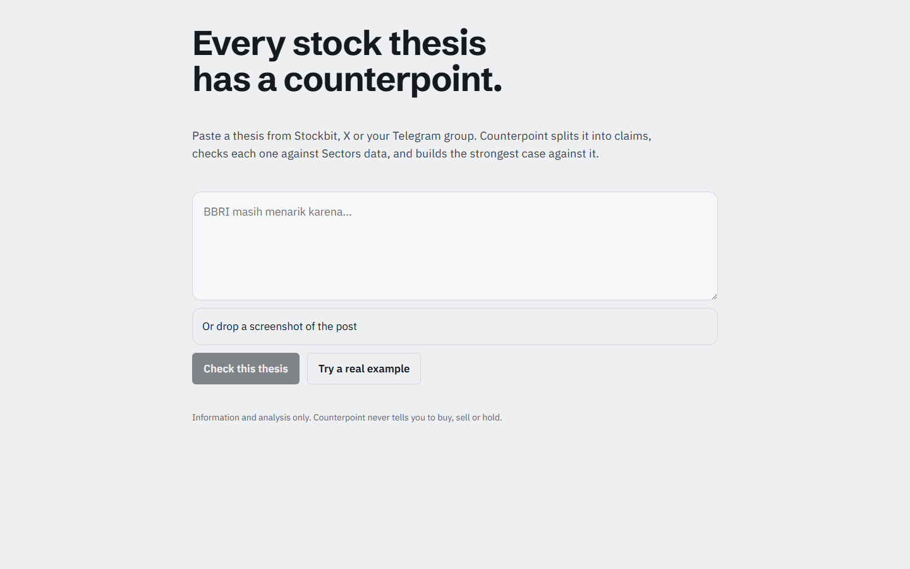
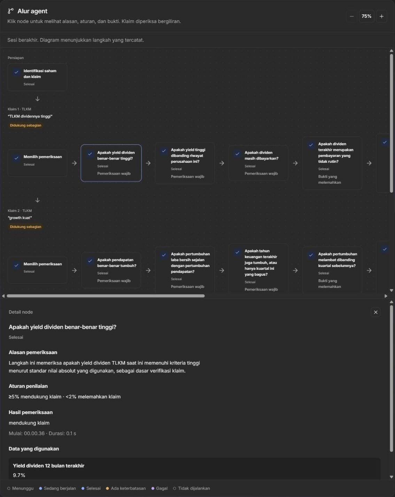
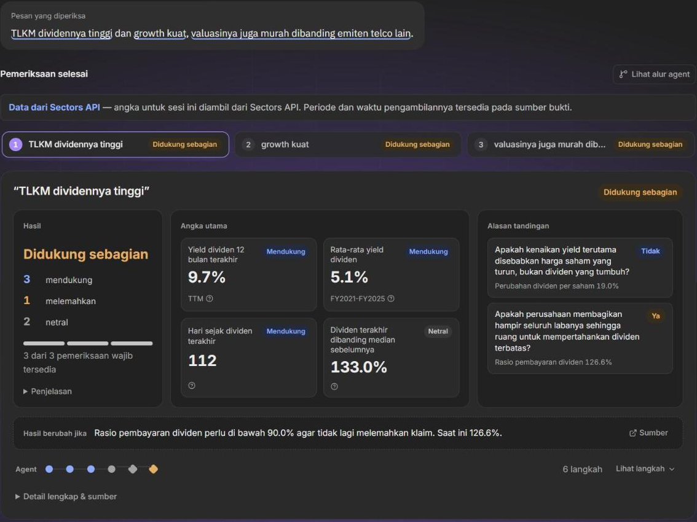

# Counterpoint

**Live: [counterpoint-idx.vercel.app](https://counterpoint-idx.vercel.app/)**

AI evidence investigation agent for Indonesian stock narratives. Paste a stock thesis (or paste a screenshot of the post); Counterpoint decomposes it into testable claims, investigates each against Sectors data, and then **argues back**: it builds the strongest opposing case and tests that too. You watch the agent reason live, predicting each result before the data arrives, and the report shows which parts are supported, weakened or unverifiable, plus **what would change each verdict**. It also works from Telegram. It never gives buy/sell/hold advice.

| Paste | Watch it investigate | Read the evidence |
| --- | --- | --- |
|  |  |  |

> Language models interpret and plan. Deterministic code calculates, validates, compares, tracks periods, selects peers, and enforces evidence provenance.

## Repository layout

```text
apps/
  api/        NestJS API: accounts, sessions, entity resolution, claim extraction, investigation agent, reports, Telegram bot
  web/        Next.js UI: landing, checks with live agent workflow, evidence report, history, integrations
packages/
  domain/     claim ontology, evidence contracts, deterministic analytics, peer policy, validators
  sectors/    typed Sectors client + adapters, labelled synthetic fixture source
  eval/       evaluation case schema and scoring
evals/        labelled claim-level and thesis-level cases
docs/         architecture, data notes, thresholds, deployment
scripts/      Sectors data-spike probe
```

## Quick start

Requirements: Node 22+, pnpm 10, Docker.

```bash
pnpm install
cp .env.example .env            # add SECTORS_API_KEY and an LLM key (OPENAI_API_KEY by default)
docker compose up -d postgres   # Postgres on localhost:5433
pnpm build:packages
pnpm --filter @counterpoint/api db:push
pnpm dev:api                    # http://localhost:4000/health
pnpm dev:web                    # http://localhost:3005 (FRONTEND_PORT in .env)
```

After pulling schema changes, run `pnpm --filter @counterpoint/api db:generate` and `db:push` again (stop the API first if Windows locks the Prisma engine DLL). After changing `packages/`, run `pnpm build:packages` and restart both servers.

The root `.env` configures both apps. For the web: shell or hosting variables win, then root `NEXT_PUBLIC_*`, then `apps/web/.env*`. `FRONTEND_PORT` and `API_PORT` set the ports; `WEB_ORIGIN` must list the exact web URL. Use `localhost` consistently for web and API, and keep server credentials out of `NEXT_PUBLIC_*`.

### Modes

| Setting | Unset | Set |
| --- | --- | --- |
| `SECTORS_API_KEY` | Synthetic fixture data (`fixture:` locators, labelled in the UI) | Live Sectors API |
| `LLM_PROVIDER` + that provider's key | Heuristic claim extractor + deterministic planner (labelled `heuristic-v1` / `deterministic-v1`) | LLM structured extraction, planner, and bounded interpretation. `openai` uses `OPENAI_API_KEY` / `OPENAI_MODEL` (the deployment uses `gpt-4.1-mini`); `anthropic` uses `ANTHROPIC_API_KEY` / `ANTHROPIC_MODEL` |
| `TELEGRAM_BOT_TOKEN` | Telegram bot off; the Integrations page shows "Belum tersedia" | Bot runs over long polling |

`SESSION_DEADLINE_MS` (default `90000`) is the hard limit for one investigation; when it is reached the report is built from what was found and marked partial. Assessments are always produced by deterministic contract rules, never by the LLM.

## How it works

### Checking a message

Sign in, open `/check`, and type or paste a message. Pasting an image (Ctrl+V) or using the paperclip reads a screenshot into the box for editing first; large screenshots are shrunk in the browser before upload. The homepage (`/`) introduces the product with a fictional, clearly labelled example.

Company mentions are resolved to IDX tickers locally, without spending Sectors credits: a committed index of every listed company (Sectors names plus Wikidata aliases and website brands, `apps/api/src/entity/company-index.data.ts`) and a hand-written nickname list (`company-aliases.ts`) match tickers, legal names and brands such as "Alfamart", "Gojek" or "Surge". Unknown names fall back to Sectors search. A name shared by several companies, or one found only by scanning the text, is offered for the user to confirm; the agent never guesses silently. Add nicknames to `company-aliases.ts` freely; rebuild the index when companies list or change names (5 Sectors calls):

```bash
pnpm --filter @counterpoint/api build-company-index
```

The check view shows a **Summary** and the **Agent workflow**: recorded steps in order, with rationale, assessment rules, evidence, timestamps and outcomes. Claims run sequentially. Evidence sources link to their public sectors.app pages.

### Live updates

The page follows a check over Server-Sent Events, replaying the session first so a reload rebuilds the same state. It polls a lightweight session revision instead (fetching the full replay only when it changes) when the stream fails, stays silent, or when the API is reached through the same-site `/api` proxy, which delivers streams in blocks. Permanent access errors stop polling. Running tool steps are persisted before execution, so reconnects show in-flight steps. A process that dies mid-investigation does not resume it; send the message again.

### Language

The interface offers Bahasa Indonesia and English (selector on every page, remembered in a cookie). Interface labels, metric names, report summaries and copied results follow that choice. Text the model writes (normalized claims, scope notes, plan reasons, interpretations) is always in Bahasa Indonesia; original quotes keep their wording.

### Accounts and history

Sign up at `/sign-up` (password of at least 10 characters); `/sign-in` and the sidebar manage sessions. Passwords are hashed with scrypt; random session tokens live in HttpOnly cookies and only their hashes are stored. Sessions expire after 7 days. Every investigation, stream, evidence, trace, report and history endpoint checks ownership. `/history` searches your checks by message or ticker, 12 per page. Email verification and password recovery are not implemented.

Cost guards: each signed-in account (and each linked Telegram account) may start `RATE_LIMIT_PER_HOUR` checks or screenshot reads per hour, `DAILY_THESIS_CAP` caps all checks per day, and sign-in attempts are limited per IP.

### Telegram

With `TELEGRAM_BOT_TOKEN` set, users link their account once on **Integrasi** (`/integrations`): the page opens the bot with a one-time code (10 minutes, stored hashed). Then they send a post's text or screenshot to the bot, confirm ambiguous companies with buttons, and receive the verdicts with a link to the full analysis; checks appear in the web history too. Commands: `/riwayat`, `/putuskan` (unlink), `/bantuan`. `PUBLIC_WEB_URL` sets the site used in bot links (default: the first `WEB_ORIGIN`).

Telegram allows one poller per bot token: run exactly one API instance per token, and use a separate bot for local development.

## Deployment

The live site runs for free on Neon (Postgres), Render (API and Telegram bot, `render.yaml`) and Vercel (web). Vercel forwards `/api/*` to Render (`API_PROXY_TARGET`, with `NEXT_PUBLIC_API_URL=/api`), so the browser talks to one site and the login cookie is first-party, including in Safari. A pinger keeps the free Render instance awake. Step-by-step guide: [docs/deploy.md](docs/deploy.md).

## Tests and evaluation

```bash
pnpm test                                           # unit tests: domain, sectors, eval, api, web
pnpm eval                                           # 24 labelled claim cases through the real engine (fixture data)
pnpm --filter @counterpoint/api eval --theses       # thesis decomposition cases (uses the LLM)
pnpm --filter @counterpoint/api eval --llm-planner  # claim cases with the LLM planner
pnpm --filter @counterpoint/api baseline "<thesis>" <TICKER> <name>  # generic-LLM baseline -> evals/baseline/
pnpm --filter @counterpoint/api export-trace <sessionId> <name>     # commit a run -> evals/traces/
```

Eval results are written to `evals/results/` (git-ignored). Representative live traces are in `evals/traces/`, and the measured baseline comparison is in `evals/baseline/README.md`. Only measured results should be reported.

## API

All endpoints except `/health` and `/auth/*` require a signed-in session.

| Endpoint | Purpose |
| --- | --- |
| `POST /auth/sign-up`, `POST /auth/sign-in`, `POST /auth/sign-out`, `GET /auth/me` | Accounts and the session cookie |
| `POST /theses` | Create a session from `{ "thesis": "..." }`; analysis runs in the background |
| `GET /theses?page&query&filter` | The signed-in user's history |
| `GET /theses/:id` | Session state, entities, claims, live trace |
| `GET /theses/:id/status` | Status and a revision for cheap polling |
| `POST /theses/:id/entities/:entityId/confirm` | Confirm an ambiguous company `{ "ticker": "BBRI" }` |
| `POST /theses/:id/investigate` | Start the bounded investigation (idempotent) |
| `GET /theses/:id/events` | Server-Sent Events: replay of the session, then live agent steps |
| `GET /theses/:id/event-snapshot` | The same replay as JSON, for polling |
| `GET /theses/:id/report` | Validated evidence report |
| `GET /theses/:id/trace` | Persisted execution events and stop reasons |
| `POST /theses/extract-text` | Transcribe a screenshot `{ "imageBase64", "mimeType" }` (not stored) |
| `GET /claims/:id/evidence` | EvidenceItems with periods and source locators |
| `GET /integrations` | Telegram availability and link state |
| `POST /integrations/telegram/link`, `DELETE /integrations/telegram` | Create a link code; unlink |
| `GET /health` | Data mode, LLM model, contract registry |

## Status

Verified end to end on live Sectors v2 data (see [docs/data-spike.md](docs/data-spike.md); run `pnpm --filter @counterpoint/api live-check`). Thresholds are fixed per contract version and explained in [docs/thresholds.md](docs/thresholds.md); the design is in [docs/architecture.md](docs/architecture.md), and product changes since PRD v1.0 in [docs/prd/CHANGELOG.md](docs/prd/CHANGELOG.md).

Information and analysis only; not investment advice.
